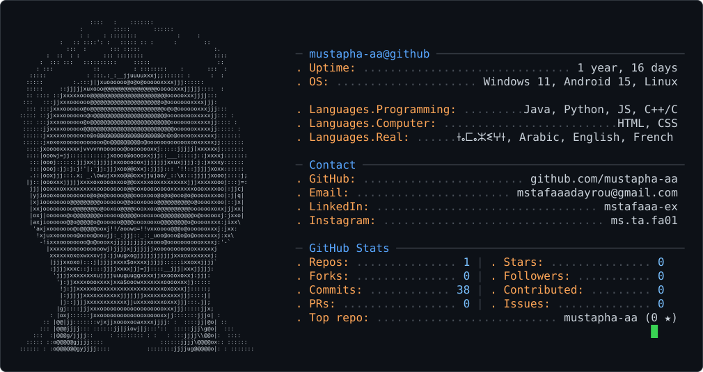

<picture>
  <source media="(prefers-color-scheme: dark)" srcset="dark_mode.svg" />
  <source media="(prefers-color-scheme: light)" srcset="light_mode.svg" />
  
</picture>

<h3>
  Front-end Developer, Data Analytics
</h3>

---

# 📊 GitHub Stats

  

<!--END_SECTION:waka-->
